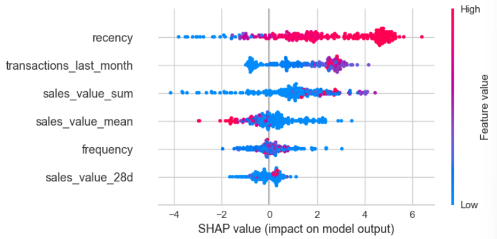
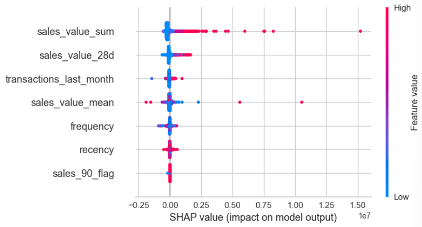

# Customer Lifetime Value with Predictive, Probabilistic and Predictive Modeling 

## Project Background

This project is designed to assist a US-based e-commerce company in leveraging customer data for customer lifetime value (CLV) estimation and predictive analysis. This project uses a 328-day dataset of customer transactions to uncover key insights into customer purchasing behaviors, enabling personalized marketing strategies and improved customer retention.

The dataset includes detailed information on customer purchases, order frequency, purchasing patterns, and recency. By utilizing predictive modeling and machine learning techniques, this project aims to:

-	Estimate customer lifetime value (CLV) using traditional churn-based and lifetime-based methods
-	Predict future customer revenue and retention likelihood using XGBoost regression and classification models
-	Segment customers based on purchasing patterns and retention risks to inform targeted marketing and resource allocation

These insights help optimize engagement strategies, improve customer loyalty, and maximize revenue potential. Sales projections, feature value, and other findings are detailed below. [Recommendations](https://github.com/hallie-marshall/ecommerce-churn-clv/edit/main/README.md#recommendations) are provided for next steps. These include targeted customer and product sets for marketing strategies. 

## Data Structure

The main table used for this project consists of over 1,048,000 rows of order information, including:

**OrderID:** unique identifier for confirmed customer orders

**ProductID:** unique identifier for products purchased on confirmed customer orders

**Quantity:** number of units ordered of the ProductID 

**UnitPrice:** price of each unit ordered of the ProductID

**InvoiceDate:** date the order is confirmed

**CustomerID:** unique identifier for customers who've placed the confirmed order

**Country:** country code of the customer. 

To support predictive modeling, additional features include:

**Recency:** number of days since the last InvoiceDate

**Frequency:** number of orders per customer

**Sales:** number of units ordered of the ProductID multiplied by Quantity

## Executive Summary

This project explores Customer Lifetime Value (CLV) prediction using both traditional modeling and machine learning techniques to estimate future sales and customer retention. By analyzing transaction data, the project reveals valuable insights into customer purchasing behavior, retention potential, and areas for strategic promotional growth.

The CLV analysis provides a data-driven foundation for optimizing customer engagement, retention efforts, and revenue forecasting. Findings reveal distinct patterns in purchasing habits, order frequency, and long-term value, highlighting opportunities to prioritize high-value customers, re-engage at-risk buyers, and tailor marketing strategies to maximize profitability.

Through a predictive modeling approach, we’ve found:
-	**Churn-Based CLV:** estimated expected revenue per customer of **$2,155,335.77**
-	**Lifetime-Based CLV:** assumes a fixed customer lifespan value of **$546,058.29**
-	These methods provide baseline CLV estimates and should not be used exclusively. Enhancing accuracy through added complexity within feature engineering is crucial for organizational use.

Through a machine learning approach, we’ve predicted:
-	**XGBoost Regression Model:** An R^2 of **92.7%** indicates a strong predictive power for estimating customer spend
-	**Mean Absolute Error (MAE):** On average, the model’s predictions deviate from actual sales by **$116,562**
-	**MAPE:** while overall predictions are strong, a relative percentage error of **522.47%** indicates that further refinement would greatly benefit the model for automated and long-term use.

 
The insights from this project enhances customer segmentation, retention strategies, and revenue forecasting. This analysis lays the groundwork for future initiatives, as highlighted in the [Recommendations](https://github.com/hallie-marshall/ecommerce-churn-clv/edit/main/README.md#recommendations) section below.

## Insights

Based on the descriptive, probabilistic, and predictive modeling approaches, the following key insights were identified from the data and model outputs.

**Descriptive & Probabilistic Findings**

1.	**Customer Spending Behavior**
-	The majority of revenue is generated by a small percentage of high-spending customers.
-	Customers exhibit varied spending habits, with some making frequent small purchases and others making infrequent but high-value transactions.
2.	**Purchase Frequency & Retention Probability**
-	The Beta-Geometric/NBD model estimated that customers with higher purchase frequency and recency are more likely to remain engaged.
-	Customers with longer gaps between purchases show higher dropout probabilities, indicating a need for retention strategies.
3.	**Expected Revenue Per Customer**
-	The Gamma-Gamma model predicts future spending per customer, revealing high variability in transaction values.
-	Some customers consistently spend high amounts per order, while others contribute lower but more frequent revenue.

**Predictive Modeling Findings**

1.	**Revenue Prediction**
-	The XGBoost Regression Model predicts customer revenue for the next 90 days, achieving an accuracy rate of 92.7%.
-	However, mean absolute error (MAE) of $116,562 and RMSE of $357,635 indicate some overestimation for high-value customers. This could be likely to high-spend outliers.
-	The model effectively captures general revenue trends but requires adjustments to improve customer-level precision. Adding additional features could decrease the error values and increase the accuracy of the model.

2.	**Churn Prediction**
-	The XGBoost Classification Model predicts whether a customer will make a purchase within 90 days, achieving:
86.86% accuracy
90.12% recall
95.21% precision
- The model is highly effective in identifying at-risk customers,  making it valuable for churn prevention strategies.

3.	**Top-Selling Products Among High-Value Customers**
-	The most frequently purchased products among top customers were identified, showing strong preferences for specific products.
-	These insights can guide inventory planning and targeted promotions to maximize revenue from existing high-value customers.

_The XGBoost Classification Model's SHAP Interpretation indicate the importance of recency in predicting future purchases._
 
 
 

_The XGBoost Regression Model's SHAP Interpretation indicate the importance of sales value, confirmed by sales value in the last 28 days, in predicting future purchases._
 
 
 
The results confirm that predictive modeling significantly enhances traditional CLV estimation by providing more accurate revenue forecasts and churn predictions. While the classification model performs exceptionally well for retention insights, the regression model requires further refinement to minimize revenue overestimation and outlier influence. These insights enable businesses to optimize marketing strategies, financial planning, and customer engagement efforts.

## Recommendations

There are several opportunities to further utilize these insights, optimize strategies and enhance operational capabilities. A few of these may include:

- **Implement Real-Time Prediction:** Enable real-time scoring to dynamically adjust marketing strategies and customer communications. By tailoring messages based on the latest customer behaviors, the company can deliver personalized, timely promotions, improving engagement, conversion rates, and overall customer experience.
  
- **Model Enhancements:** Address overestimation of high-value customers by adjusting feature importance, parameters, or trying additional models. Optimizing the model’s feature set will increase the accuracy and value of the model to the organization.
    
- **Leverage A/B Testing and Multivariate Testing:** Use A/B testing or multi-variate testing to assess the performance of various marketing strategies across different segments. By analyzing performance data, the company can identify which content, offers, and communication channels drive the highest engagement and conversion rates. This iterative approach enables data-driven optimization, ensuring marketing efforts are continuously refined for maximum impact.

These recommendations provide next steps on a pathway to further harness the power of the provided customer segmentation insights, enabling the organization to improve operational efficiency, boost customer satisfaction, and drive sustainable growth.

## Assumptions and Caveats

- Data was only used for US-based customers. Including foreign customer data may lead to differing results.
- The dataset consists of orders of a 328-day period, with Invoice Dates ranging from 1/3/2024 to 11/28/2024. Trends observed in this timeframe may not fully account for long-term customer behaviors or seasonal variations beyond this window.
- Classification modeling assumes a fixed 90-day churn window.
- Models do not account for external influences such as economic trends, competitor activity, or shifts in purchasing behavior. 
- Additional assumptions used as constants include:
  * Customer Lifetime = 3 years
  * Profit Margin = 18%
  * Discount Rate (for lifetime financial valuation) = 1.0%
